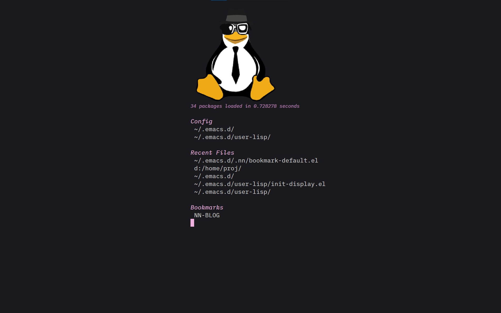
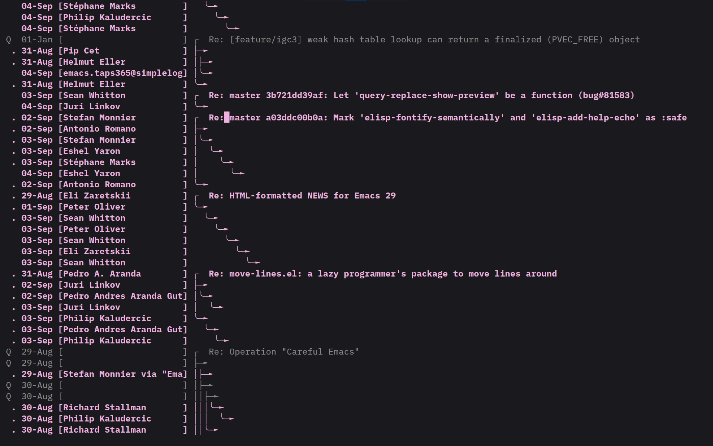
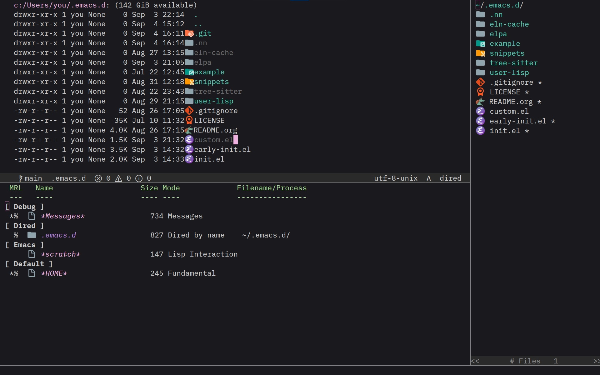
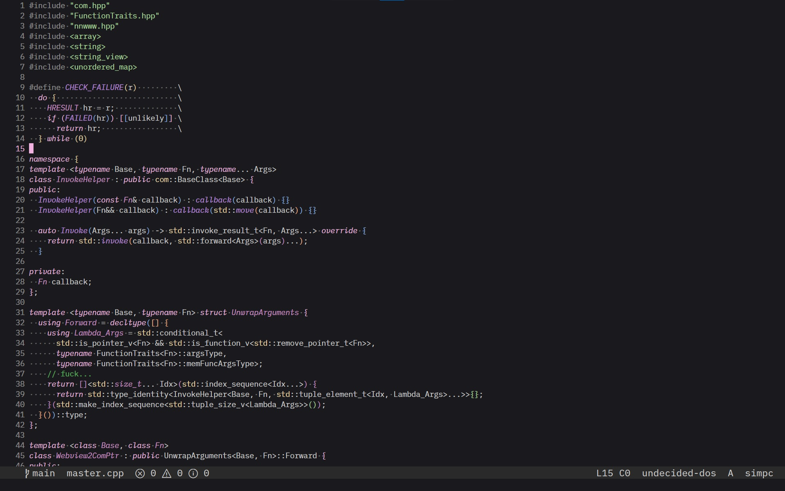

#+TITLE: Elegant Emacs
#+AUTHOR: zhaodaniu
#+OPTIONS: toc: nil

#+HTML: 

#+HTML:   
#+HTML:    
#+HTML:   
#+HTML:   
#+HTML: 

#+HTML: 

* Introduction

Elegant Emacs is a personal, batteries-included Emacs configuration for GNU
Emacs 31 and newer.  It keeps configuration modules small under
=user-lisp/=, uses built-in Emacs features first, and adds packages only when
they improve everyday editing or development.  Startup work is deferred where
possible, while customization and persistent state remain easy to find in
=user-lisp/init-def.el= and =.nn=.

* Features

- *Fast startup and sensible defaults.* Expensive setup is deferred until the
  first input or file visit, so Emacs stays responsive while common editing and
  project state work out of the box.
- *Editing and appearance.* Completion, formatting, folding, multiple cursors,
  file and buffer management, font and icon fallback, and the =nn-world= dark
  theme make the editor comfortable for daily use.
- *Programming.* Tree-sitter modes cover C/C++, Emacs Lisp, JavaScript and
  TypeScript, web templates, shell, Org, Markdown, JSON, and YAML.  Eglot
  provides LSP navigation, renaming, references, and code actions; Flymake
  shows diagnostics; Dape and GDB handle debugging.
- *Projects and navigation.* Built-in Project support with ripgrep search,
  Git-aware navigation, xref, Citre/readtags, bookmarks, and Dired makes it
  easy to find and manage code and files.
- *Terminals and daily tools.* Ghostel provides a project-aware terminal,
  while Eshell, EWW, Org, translation, mail/news, and IRC cover common work
  without leaving Emacs.
- *Live Server.* The =live-server= package starts a small Python HTTP server
  for a selected directory, with configurable host and port, directory
  listings, and automatic browser reload when served files change.
- *Simple mpv.* The =simple-mpv= package plays files through the external
  =mpv= player, browses a configured audio directory, and provides an Emacs
  control buffer with metadata, progress, play/pause, previous/next, shuffle,
  loop, and seeking.  Use =C-c p= in Dired to play a file or =C-c m= to open
  the audio browser.

The most useful defaults are:

|---------------+-------------------------------|
| Key           | Action                        |
|---------------+-------------------------------|
| =<f1>=          | Format the current buffer     |
| =<f2>=          | Rename the current symbol     |
| =<f5>=          | Start Dape debugging          |
| =<f8>= / =S-<f8>= | Next / previous Flymake error |
| =<f12>=         | Jump to a definition or tag   |
| =C-c s=         | Search files in the project   |
| =C-`=           | Toggle the Ghostel terminal   |
| =C-<f1>=        | Show the =*HOME*= dashboard     |
|---------------+-------------------------------|
* Requirements

This configuration supports only GNU Emacs 31 and newer.  A graphical frame is
recommended for fonts, icons, child frames, and the Dape toolbar; core editing
also works in a terminal frame.  Git is required for installation and
version-control integration.

Optional tools such as =ripgrep=, language servers, =gdb=, =aspell=,
=prettier=, =clang-format=, =shfmt=, Python, =mpv=, and a Bash executable
enable their corresponding integrations.  The first launch needs network
access so =use-package= can install missing packages; later launches use the
local package cache.

* Install

Clone into Emacs' conventional user directory and start Emacs normally:

#+begin_src sh
git clone https://github.com/zHaOdANiuu/.emacs.d.git ~/.emacs.d
#+end_src

No framework bootstrap command is required.  On the first launch, the
configuration creates its persistent state under =~/.emacs.d/.nn/=.  A
Codeberg mirror is available at
[[https://codeberg.org/zdn/.emacs.d.git][Codeberg]].

* Preview

#+ATTR_ORG: :width 400
 
 
